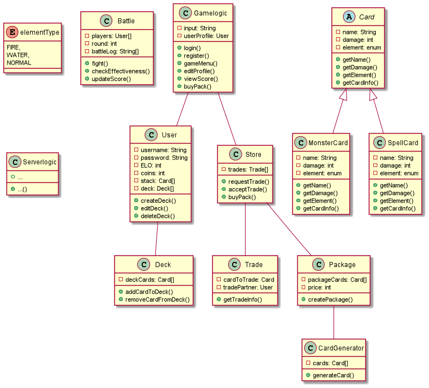
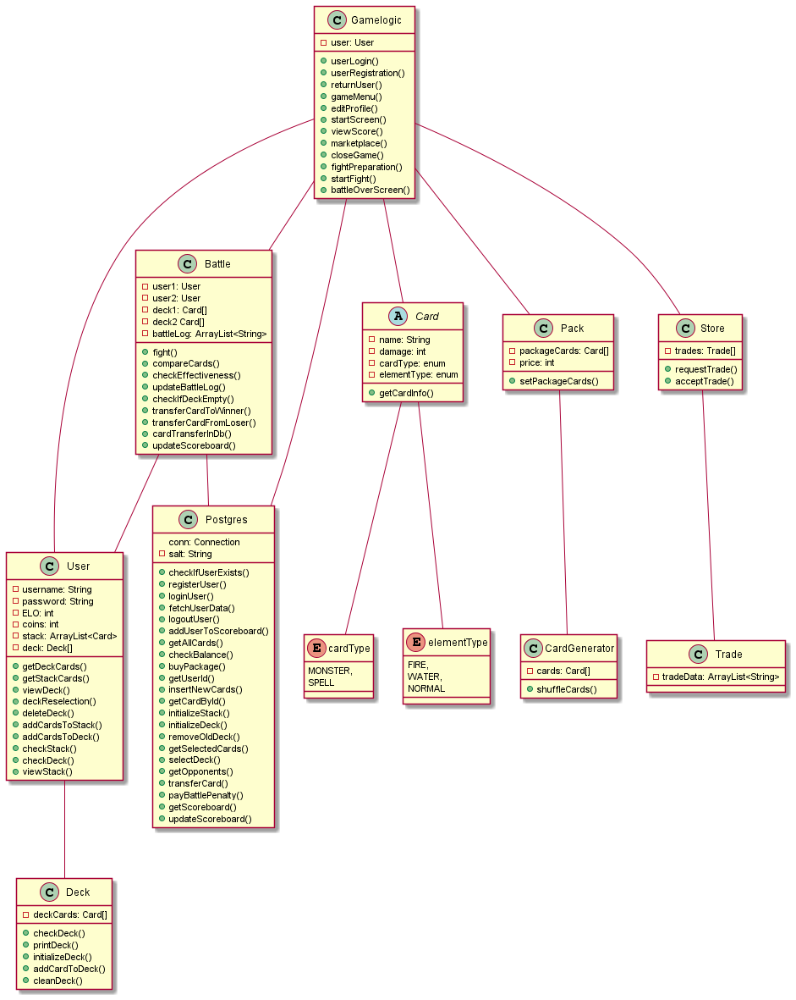

# Monster Trading Cards Game (MTCG)
**From the project specification:** The goal of this project was to create a HTTP/REST-based server as a platform for trading and battling with and against each other in a magical card-game world.

---

## UML Diagram
Here is the first UML diagram I made at the beginning of the semester (as a draft). Although I thought I won't be changing the structure a lot it did actually change a lot in the process. Especially because I unfortunately didn't manage to implement the server which on the other hand means that my application is just a simple command line program.

And here is the diagram of how the whole project structure currently looks like. I removed the Serverlogic class since my project does not implement a HTTP server. However, I added an extra class to handle the whole Battle logic (Battle.java) and also renamed "Package" into "Pack" because my IDE was a little bit confused with using the former one due to similarities with a built-in java class that was apparently also called "Package". For the data transfer to and from the database I also implemented a class called "Postgres".

## Database
I personally think that my database design is a bit unusual but it does its work and is actually quite easy to understand.
In total my database has five tables - "users", "cards", "user_cards", "scoreboard" and "trades".

[SQL Script for database](./docs/mtcg_database-sql.sql)

[Databse Schema](./docs/mtcg_database-schema.png)

### users
All users and their data is stored in this one. Every user can be uniquely identified by their ID which is created using the built-in UUID functionality in Java. In addition to that, the username column was created using the UNIQUE attribute which means there cannot exist two identical usernames at once in the table. The password is stored as a hash. For this I used a library called [BCrypt](https://jar-download.com/artifacts/de.svenkubiak/jBCrypt/0.4.1/source-code).

### cards
All cards that exist in the game are stored in here. They can be uniquely identified by their ID which is also an UUID. The other attributes are simply stored as normal values in each column.

### user_cards
Everytime a user acquires cards they will be displayed in this table. Every entry can be used to find out which user is in possession of which card and also if that specific card is in their deck. The "in_deck" column provides that information. If that value is "1" then the owner of that card has it in their deck. If the value is "0" the card is only in their stack. If they log into their account and then put that card in their deck the corresponding value will change to "1".

### scoreboard
This table is built very simple. It also has an ID to uniquely identify specific entries and besides the username and ELO of each user, it also shows the amount of wins, defeats, draws and total coins spent.

### trades
Unfortunately, I was also not able to implement the trading functionality but the idea behind it is pretty simple. Everytime a user wants to trade a card he pushes it to the store. In this case the "offer_user_id" would be the ID of the user that posted the trade request and the "give_card_id" would be the card selected for trading. "get_card_id" would be the card that the trade offerer wants to trade his for and the "accept_user_id" would be the user that accepts that trade. Nonetheless, this design could also be changed into a easier and more clearer one and if I would have implemented it I most likely would have changed it.

## Unit Testing
I have to admit that I developed my Unit Tests a bit late in my project but while writing them they really opened my eyes. I would have saved quite a few hours of debugging and troubleshooting if I would have just written some tests and let them check the result of my code.

My Unit Tests are mainly about pretty small pieces of code which however have a big impact on the whole program itself. With "small pieces" I mean short methods in e.g. the Battle class that check the damage of each card and therefore tells the program which player won the current round. To add to that, for rather basic and unspectacular classes like Deck, Package, Card etc. I did not write any tests because these classes mostly consisted of either only Getters/Setter or non-critical methods.

**Unit Tests for the User class:**
    
    - test_checkDeck_true()
    - test_checkStack_false()
    - test_getDeckCards_null()
    - test_getStackCards_null()

**Unit Tests for the CardGenerator class:**

    - test_checkCardArrayLength_5()

**Unit Tests for the Database class:**

    - test_checkIfUserExists_true()
    - test_registerUser_true()
    - test_loginUser_true()
    - test_fetchUserData_NotNull()
    - test_getAllCards_NotNull()
    - test_checkBalance_true()
    - test_buyPackage_5()
    - test_getUserId_NotNull()
    - test_getCardById_NotNull()
    - test_initializeDeck_NotNull()
    - test_initializeStack_5()
    - test_getOpponents_NotEquals0()
    - test_getScoreboard_NotEquals0()

**Unit Tests for the Battle class:**

    - test_compareCards_0()
    - test_compareCards_1()
    - test_compareCards_2()
    - test_checkEffectiveness_negative3()
    - test_checkEffectiveness_negative1()
    - test_checkEffectiveness_negative2()
    - test_checkIfDeckEmpty_true()

## Failures of this project

    - No HTTP/REST-based server implemented
        - therefore no use of the CURL script and no Token-based security
    
    - No Trading functionality

## Mandatory Unique feature

Before a battle starts the user has two options - to accept the battle or to decline it. In case the battle is declined the user needs to pay a penalty of 5 coins.

## Time Spent

**Planning:**

    - UML Diagram: ~1 hour
    - Database: ~1.5 hours

**Coding/Implementation:**

    - Creation of basic project structure: ~2 hours
    - Main Gamelogic: ~35 hours
    - Battlelogic: ~12 hours
    - Data-Handling with Database: ~17 hours

**Testing:**
    
    - Unit Tests: ~3 hours

## Link to GitHub

[MTCG on GitHub](https://github.com/zpc912/mtcg_swen)